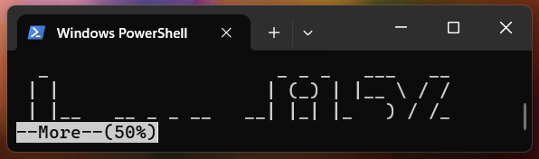
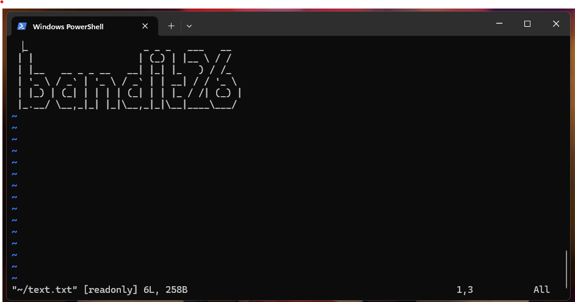
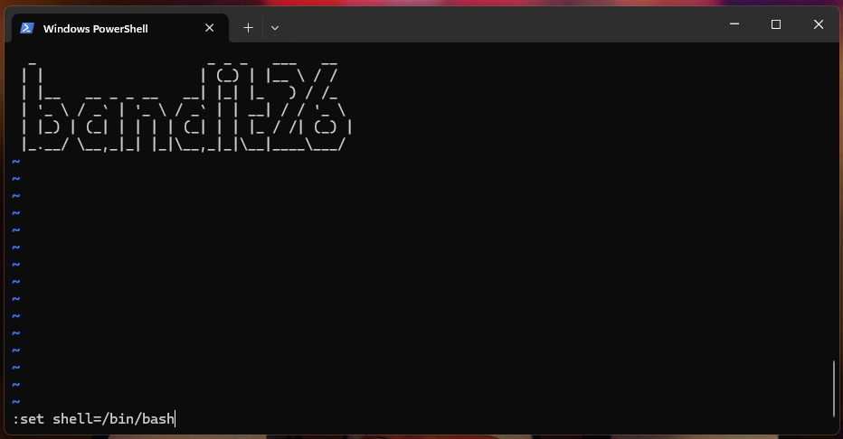
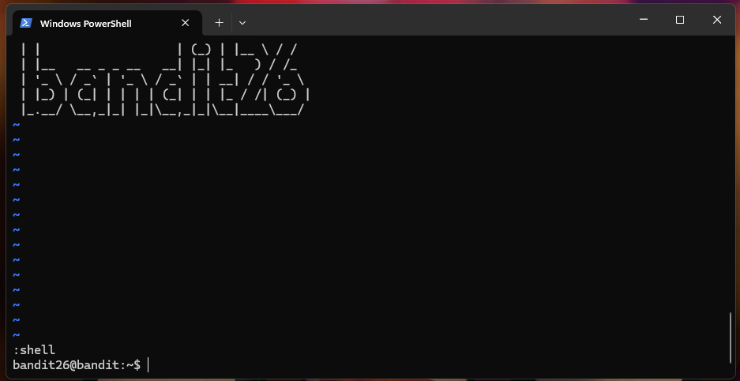

# Nível 24 - 25 (OverTheWire: Bandit)

### 📌 Descrição do Desafio

Logging in to bandit26 from bandit25 should be fairly easy… The shell for user bandit26 is not /bin/bash, but something else. Find out what it is, how it works and how to break out of it.

---

### 🎯 Objetivo

Rapaz, alguém tem que ver isso aí KKKKKKKKKKKKKKKKK. Temos q descobrir qual shell o bandit26 usa e como escapar dela.

---

### 💡 Dica Bacana

O arquivo `/etc/passwd` é um arquivo básico do Linux que guarda informações sobre todos os usuários do sistema. Uma dessas informações é qual a shell o usuário está usando. Por exemplo:

```
bandit20:x:11020:11020:bandit level 20:/home/bandit20:/bin/bash
bandit21:x:11021:11021:bandit level 21:/home/bandit21:/bin/bash
bandit22:x:11022:11022:bandit level 22:/home/bandit22:/bin/bash
bandit23:x:11023:11023:bandit level 23:/home/bandit23:/bin/bash
bandit24:x:11024:11024:bandit level 24:/home/bandit24:/bin/bash
bandit25:x:11025:11025:bandit level 25:/home/bandit25:/bin/bash
```
É possivel notar que esses usuários usam o shell /bin/bash

---


### 🔍 Passo a Passo da Lógica

* Ao entrar no servidor, a primeira coisa q fiz foi listar o que tinha no direório inicial:

```
bandit25@bandit:~$ ls
bandit26.sshkey
```

* Curiosamente, tem uma chave ssh, copiei para minha máquina e tentei acessar.

* Ao acessar, o texto inicial aparece mas com algo a mais escrito. Após isso, também fui desconectado:

```
  _                     _ _ _   ___   __
 | |                   | (_) | |__ \ / /
 | |__   __ _ _ __   __| |_| |_   ) / /_
 | '_ \ / _` | '_ \ / _` | | __| / / '_ \
 | |_) | (_| | | | | (_| | | |_ / /| (_) |
 |_.__/ \__,_|_| |_|\__,_|_|\__|____\___/
Connection to bandit.labs.overthewire.org closed.
```

* Com isso, entendi do que se tratava o desafio, existe outro caminho no `/etc/passwd` que não é `/bin/bash` para o bandit26:

```
bandit25@bandit:~$ grep bandit26 /etc/passwd
bandit26:x:11026:11026:bandit level 26:/home/bandit26:/usr/bin/showtext
```

* Abrindo o arquivo showtext, temos o seguinte:

```
bandit25@bandit:~$ cat /usr/bin/showtext
#!/bin/sh

export TERM=linux

exec more ~/text.txt
exit 0
```

* Ou seja, na home do bandit26 tem um arquivo text.txt que está sendo chamado (provavelmente retornando aquele texto "bandit26") e depois está dando um exit 0, fechando a conexão.

* O pulo do gato está nesse `more`, ele basicamente vai permitir que você vá digitando enter para mostrar o contéudo, caso sua tela não seja capaz de mostrar tudo.

### O que será que se acontece se acessar o servidor com a janela do terminal reduzida? 😈



É meus amigos, os caras são malandros... Agora eis a questão, o que fazer agora?

---

#### 💡Outra dica

Existe um editor de texto nativo do Unix que possui comandos internos e permite executar programas do sistema. Dentro dele é possível abrir um shell real usando o comandos, o nome dele é vi.
Uma coisa interessante sobre ele, é que você pode abrir ele no terminal quando o more entra em modo interativo, apenas apertando a tecla `v`.



Ah, e quando entra em modo interativo, você já pode voltar o terminal para o tamanho normal.

* Agora com o vi aberto, é bem simples, você só precisa mudar a shell de `/usr/bin/showtext` para `/bin/bash`. Faça isso digitando:



* Pronto, agora basta digitar :shell e uaaaaau, entrou no terminal:



---

### ✔️ Resultado Final

Se quiser pegar a senha em `/etc/bandit_pass/bandit26`, pode arrochar, mas eu particularmente recomendo que deixe esse terminal aí aberto porque o próximo level é fácil e é melhor fazer logo para se livrar de fazer todo esse trabalho de novo para entrar no bandit26.

---

### 📚 Aprendizados do Nível

- Aprendemos como identificar o shell de um usuário através do arquivo `passwd` e como alguns sistemas usam shells alternativos para restringir ações. 
- Aprendemos também como o `more` se comporta quando o terminal está pequeno e como isso pode ser explorado para ativar o `vi`. 
- A partir do `vi`, vimos que é possível executar comandos e até abrir um shell completo. 
- Esse nível mostrou que o criador desse desafio **DEFINITIVAMENTE NÃO SABE O QUE É SER UM DESAFIO PARA INICIANTES KKKKKKKKKKKKKK.** Mas foi legal analisar o comportamento de ferramentas simples do Linux e ver como pequenas brechas, como um editor embutido, podem permitir escapar de ambientes restritos.

---

## 🔗 Próximo Nível

[Ir para o próximo nível](../Level%2026%20-%2027/writeup.md)